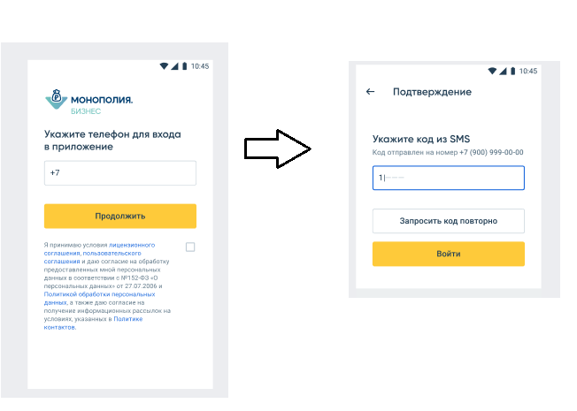

# Задачка

Есть некоторое приложение, в котором есть баг с тем, что пользователей иногда может часто выкидывать из личного кабинета.
Back-end работает на токенах, но людей выкидывает все равно чаще чем должно было. 
Нужно посмотреть код, понять в чем проблема в коде, предложить вариант решения и рассказать какие есть проблемы в этом примере.

# Как работает аутентификация и авторизация в приложении
Есть экран аутентификации. В нем пользователь вводит телефон и после этого смс.

При успешном подтверждении SMS от back-end приходит пара токенов accessToken и refreshToken.

Это распространенный подход аутентификации и авторизации на базе токенов, в интернете очень много статей на эту тему. Можно почитать про JWT токены или просто загуглить access refresh токены.



# Контракт метода login на back-end

Этот метод вызывается когда вводят код из смс при аутентификации.

Request
```
{
  "phone": "string",
  "code": "string"
}
```
Response
```
{
  "userId": "dde85c6d-d1d2-47ba-ba7c-123124324",
  "accessToken": {
    "token": "access token value",
    "validTo": "2022-07-25T13:36:18.107Z"
  },
  "refreshToken": {
    "token": "refresh token value",
    "validTo": "2022-07-25T13:36:18.108Z"
  }
}
```

# Как используются токены

После того как приложение получило токены от бэкенда оно сохраняет эту пару ключей. 

Все следующие запросы для получения данных внутри личного кабинет отправляются с хедером Authorization, в который добавляется полученный access token.

:warning: :warning: :warning: Если от бэкенда пришла HTTP ошибка 401, то необходимо запросить новую пару ключей от бэкенда через метод refresh

# Метод refresh 
Request
```
{
  "refreshToken": "refresh token value"
}
```
Response
```
{
  "userId": "dde85c6d-d1d2-47ba-ba7c-123124324",
  "accessToken": {
    "token": "access token value",
    "validTo": "2022-07-25T13:36:18.107Z"
  },
  "refreshToken": {
    "token": "refresh token value",
    "validTo": "2022-07-25T13:36:18.108Z"
  }
}
```
:warning: :warning: :warning: Если же на бэкенд передать некорректный refresh токен, то бэкенд вернет HTTP ошибку 422

# Подробнее о баге

Есть проблема в мобильном приложении, что пользователей иногда почему-то выкидывает из личного кабинета чаще, чем должно.

Проблема на стороне мобильного приложения, скорее всего как-то неправильно написан код, что приводит к таким багам.

Нужно посмотреть код, подумать из-за чего может возникать ошибка, подумать как ее можно исправить и какие проблемы есть в текущем коде.

Информация для того, чтобы было проще разобраться:

- Код из реального приложения, полный проект выложить не можем, но прикладываем файлы, которые могут быть интересны при поиске ошибки
- AuthorizationInterceptor - добавляет в каждый запрос Authorization хедер 
- RefreshTokenAuthenticator - там основная логика по работе с refresh токеном
- KeyValueStore - хранилище значенией, оттуда считываются токены и туда сохраняются
- RetrofitFactory - там можно посмотреть как подключаются интерсептеры и RefreshTokenAuthenticator
- DataClasses - там реквест, респонс
- Скорее всего проблема именно в файле RefreshTokenAuthenticator

# Логи
Логи могут помочь разобраться с проблемой. [Логи можно посмотреть здесь](./docs/logs.md)
